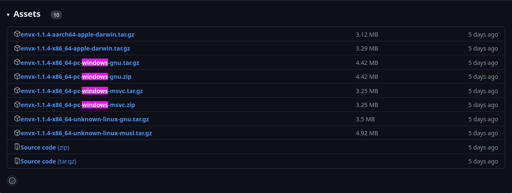

# Windows Installation

## Installation

1. Download the latest release from [here](https://github.com/envx-project/cli/releases/latest)
   - Choose the `x86_64-pc-windows-msvc.zip` file
   - 
2. Unzip the file
3. Create a new folder called `envx` in your `C:\` directory
4. Copy the `envx.exe` file from the unzipped folder to the `envx` folder
5. Add the `envx` folder to your PATH environment variable (instructions [here](https://www.architectryan.com/2018/03/17/add-to-the-path-on-windows-10/))

## Portable Installation

1. Download the latest release from [here](https://github.com/envx-project/cli/releases/latest)
   - Choose the `x86_64-pc-windows-msvc.zip` file
   - 
2. Unzip the file
3. Open a terminal and navigate to the unzipped folder
4. Run `envx.exe` to start the program

## Troubleshooting

### Error: The term 'envx' is not recognized as the name of a cmdlet, function, script file, or operable program

If you get this error, you probably tried to run the program from the global scope when you followed the portable installation instructions.
To fix this, you can either:

- Run the program from the local scope by navigating to the `envx` folder and running `envx.exe`
- Add the `envx` folder to your PATH environment variable (instructions [here](https://www.architectryan.com/2018/03/17/add-to-the-path-on-windows-10/))
