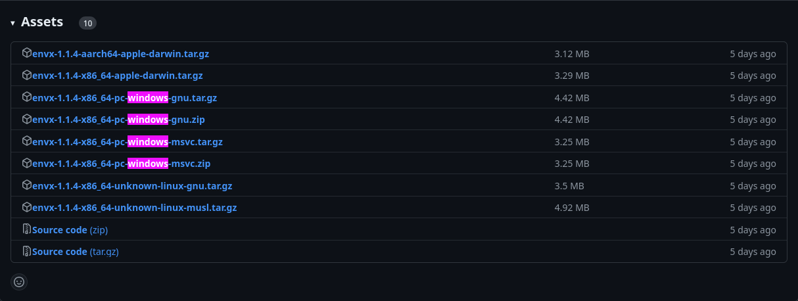

# Windows Installation

## Installation

Run this in PowerShell or Command Prompt:

```powershell
powershell -c "irm https://raw.githubusercontent.com/envx-project/cli/main/install.ps1 | iex"
```

The script downloads the latest release, verifies its SHA256 checksum, installs
`envx.exe` to `%LOCALAPPDATA%\Programs\envx` (no administrator rights needed),
and adds that folder to your user `PATH`. Open a new terminal afterwards.

Update later with `envx update`.

Environment variables customise the install:

| Variable | Effect |
| --- | --- |
| `ENVX_VERSION` | Install a specific release, e.g. `2.16.0` |
| `ENVX_INSTALL_DIR` | Install somewhere other than `%LOCALAPPDATA%\Programs\envx` |
| `ENVX_PLATFORM` | `msvc` (default) or `gnu` build |
| `ENVX_NO_MODIFY_PATH` | Set to `1` to leave `PATH` unchanged |
| `ENVX_UNINSTALL` | Set to `1` to remove envx and its `PATH` entry |

For example, to uninstall:

```powershell
$env:ENVX_UNINSTALL = '1'; irm https://raw.githubusercontent.com/envx-project/cli/main/install.ps1 | iex
```

## Manual installation

1. Download `x86_64-pc-windows-msvc.zip` from the [latest release](https://github.com/envx-project/cli/releases/latest)
   - 
2. Unzip it and move `envx.exe` to a folder of your choice
3. Add that folder to your `PATH` environment variable

## Troubleshooting

### The term 'envx' is not recognized as the name of a cmdlet, function, script file, or operable program

The terminal was opened before `PATH` changed. Open a new terminal. If it still
fails, check that the install folder is listed in your user `PATH`.
